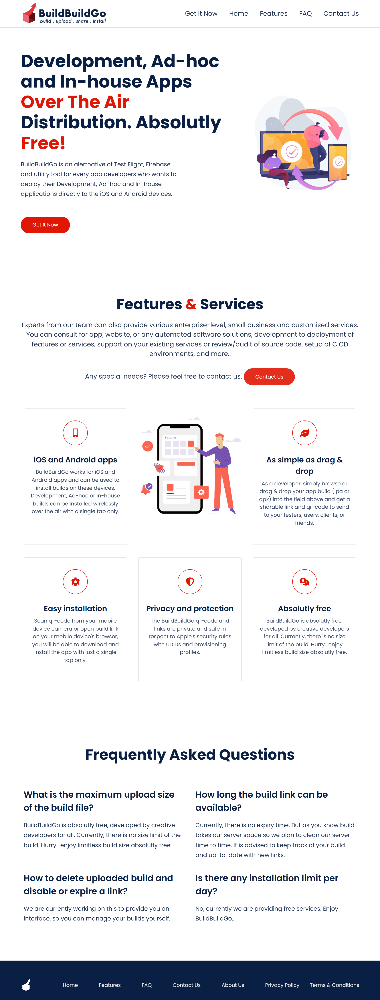
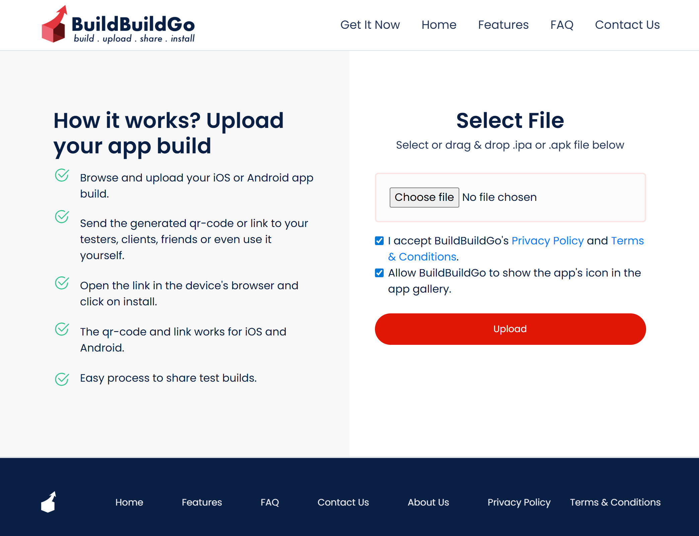
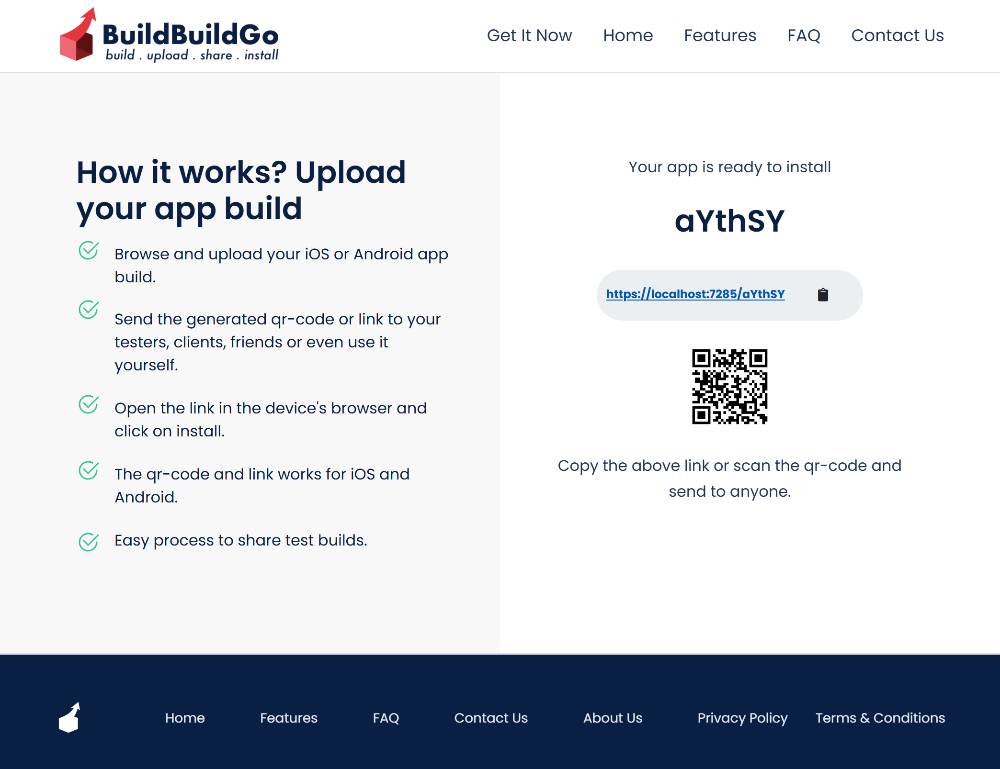
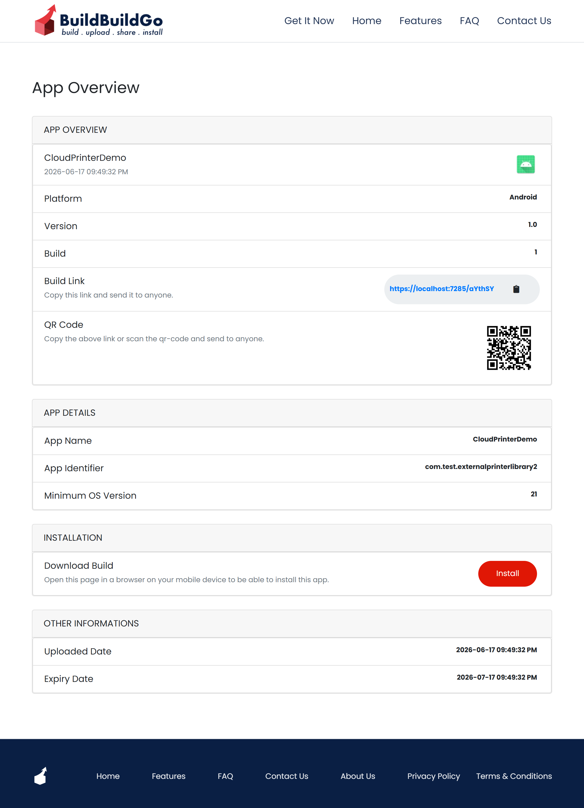

# BuildBuildGo

### Development, Ad-Hoc and In-House App Distribution. Absolutely Free.

BuildBuildGo is an alternative source to TestFlight, Firebase App Distribution and other OTA deployment platforms.

Distribute your Development, Ad-Hoc and Enterprise iOS and Android applications directly to testers and internal teams without app store approvals.

---

## Why BuildBuildGo?

Most app distribution platforms are either:

* Expensive
* Limited in features
* Require third-party services
* Not self-hostable

BuildBuildGo gives developers complete control over application distribution.

### Features

✅ iOS Ad-Hoc Distribution
✅ iOS Enterprise Distribution
✅ Android APK Distribution
✅ Android AAB Support
✅ OTA Installation
✅ QR Code Installation
✅ Build Version Management
✅ Team Access Control
✅ Release Notes
✅ Self Hosted
✅ Completely Free

---

## How It Works

1. Upload an iOS or Android build.
2. BuildBuildGo generates an installation page.
3. Share the installation link or QR code.
4. Testers install directly on their devices.
5. Track versions and manage releases.

---

## Use Cases

### Mobile Development Teams

Share development builds instantly.

### QA Teams

Distribute builds without App Store delays.

### Agencies

Manage builds for multiple clients.

### Enterprise Organizations

Distribute internal applications securely.

---

## Comparison

| Feature         | BuildBuildGo | TestFlight | Firebase |
| --------------- | ------------ | ---------- | -------- |
| Self Hosted     | ✅            | ❌          | ❌        |
| Free            | ✅            | ❌          | Partial  |
| Android Support | ✅            | ❌          | ✅        |
| iOS Support     | ✅            | ✅          | Partial  |
| QR Installation | ✅            | ❌          | ❌        |
| Full Control    | ✅            | ❌          | ❌        |

---

## Screenshots

See the screenshots below.

---

## What You Can Explore

* Product screenshots
* Documentation
* Feature roadmap

## Why Private?

BuildBuildGo is under development. We want to build a strong contributor community while ensuring code quality, security, and a sustainable roadmap.

## Code Base

BuildBuildGo source code is available in .Net Core and Node.js with same features.

.Net Core: https://github.com/amitanmol/BuildBuildGoLive
Node.js: https://github.com/amitanmol/buildbuildgo

## Request Access

The source code is currently maintained in a private repository.

We are welcoming:

* Contributors
* Security reviewers
* Enterprise partners
* Self-hosting testers

If you are interested in contributing or reviewing the codebase, please open a discussion or contact us through mail: amit.aanmol@gmail.com.

Access requests are reviewed individually.
